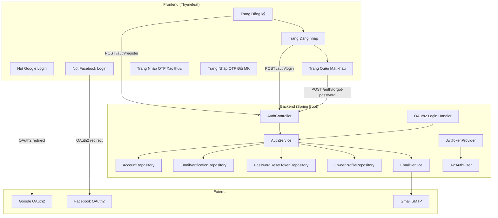
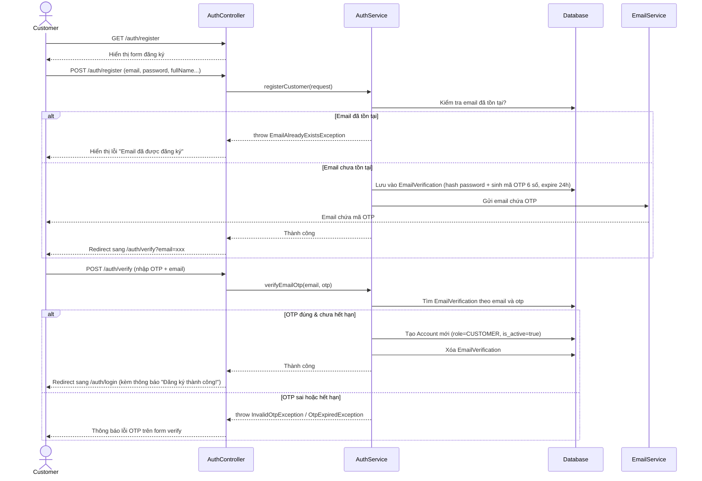
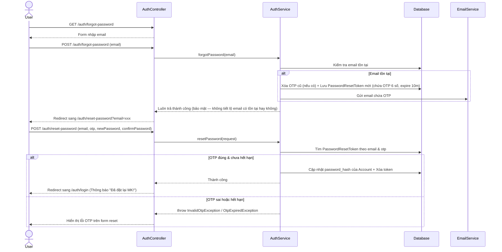

# Kế hoạch triển khai: Hệ thống Đăng ký / Đăng nhập / Quên mật khẩu — SportHub

## Bối cảnh

Dự án SportHub hiện tại có sẵn:
- **Entities**: `Account`, `OwnerProfile`, `EmailVerification`, `PasswordResetToken` đã map đầy đủ với DB.
- **Config**: `SecurityConfig` cơ bản đã có `BCryptPasswordEncoder` và phân quyền URL sơ bộ.
- **Dependencies**: Spring Security, Spring Data JPA, Thymeleaf, Lombok, Validation đã có trong `pom.xml`.
- **Chưa có**: JWT, OAuth2 (Google/Facebook), Email sender, i18n, toàn bộ logic backend (Service, Repository, Controller, DTO).

---

## User Review Required

> [!IMPORTANT]
> **Kiến trúc bảo mật: Session-based vs JWT**
>
> Vì dự án đang dùng **Thymeleaf (server-side rendering)**, kiến trúc khuyến nghị nhất là:
> - **Mặc định sử dụng Session-based authentication** (chuẩn của Spring Security với form login). Session lưu trên server, không cần gửi token qua header.
> - **Bổ sung JWT chỉ cho các REST API endpoint** (`/api/**`) — nếu sau này cần tích hợp mobile app hoặc frontend SPA.
>
> Cách này phù hợp nhất với kiến trúc hiện tại (Thymeleaf + MVC). Nếu bạn muốn dùng **100% JWT** (stateless), hãy cho tôi biết.

> [!IMPORTANT]
> **Đăng ký qua Facebook**
>
> Facebook Login yêu cầu tạo Facebook App trên [developers.facebook.com](https://developers.facebook.com), quá trình review app của Facebook khá chậm (vài tuần). Tuy nhiên về mặt code, nó gần giống Google OAuth2 nên tôi sẽ code sẵn cả hai. Bạn chỉ cần điền `client-id` và `client-secret` vào file `application-local.properties` khi nào có.

---

## Cấu hình đã chốt (Theo yêu cầu của bạn)
- **Dịch vụ Email**: Sử dụng **SMTP Gmail**.
- **Xác thực**: Sử dụng **mã OTP 6 số** (thay vì click link) cho cả Đăng ký và Quên mật khẩu.
- **Thời hạn OTP**:
  - Đăng ký tài khoản: Hết hạn sau **24 giờ**.
  - Quên mật khẩu: Hết hạn sau **10 phút**.
- **Luồng Owner**: Đăng ký xong sẽ ở trạng thái `PENDING`, cần Admin vào duyệt (`APPROVED`) mới được hoạt động bình thường.

---

## Tổng quan Kiến trúc



---

## Proposed Changes — Chi tiết theo Component

---

### Component 1: Dependencies (pom.xml)

#### [MODIFY] [pom.xml](file:///f:/FPT/OJT/Mock%20Project/SportHub/sport-hub/pom.xml)

Thêm các dependencies mới:

| Dependency | Mục đích |
|---|---|
| `spring-boot-starter-mail` | Gửi email chứa mã OTP xác thực & reset password |
| `spring-boot-starter-oauth2-client` | Google & Facebook OAuth2 Login |
| `io.jsonwebtoken:jjwt-api` + `jjwt-impl` + `jjwt-jackson` (v0.12.6) | Tạo và xác thực JWT token cho REST API |

---

### Component 2: Cấu hình (Config & Properties)

#### [MODIFY] [application.properties](file:///f:/FPT/OJT/Mock%20Project/SportHub/sport-hub/src/main/resources/application.properties)

Thêm các block cấu hình template (giá trị placeholder):
- **Email SMTP**: host (smtp.gmail.com), port, username, password (placeholder)
- **OAuth2 Google**: `spring.security.oauth2.client.registration.google.*` (placeholder)
- **OAuth2 Facebook**: `spring.security.oauth2.client.registration.facebook.*` (placeholder)
- **JWT**: secret key, expiration time (placeholder)
- **App config**: Thời hạn OTP verify email (24h), thời hạn OTP reset password (10m)

> Các giá trị nhạy cảm thực tế sẽ nằm trong `application-local.properties` (đã gitignore).

#### [MODIFY] [SecurityConfig.java](file:///f:/FPT/OJT/Mock%20Project/SportHub/sport-hub/src/main/java/com/mvc/mock_project/config/SecurityConfig.java)

Cập nhật toàn diện:
- Cấu hình `formLogin` với trang login custom (`/auth/login`).
- Cấu hình `oauth2Login` cho Google & Facebook, chỉ định `userInfoEndpoint` và custom `OAuth2UserService`.
- Thêm `JwtAuthenticationFilter` vào filter chain (chỉ cho đường `/api/**`).
- Cấu hình `logout` handler.
- Mở rộng danh sách URL public (trang đăng ký, nhập OTP xác nhận email, quên mật khẩu, nhập OTP reset password...).

#### [NEW] [WebConfig.java](file:///f:/FPT/OJT/Mock%20Project/SportHub/sport-hub/src/main/java/com/mvc/mock_project/config/WebConfig.java)

Cấu hình `LocaleResolver` và `LocaleChangeInterceptor` cho hệ thống đa ngôn ngữ (i18n):
- `SessionLocaleResolver` với default locale là `Locale.ENGLISH`.
- `LocaleChangeInterceptor` lắng nghe param `?lang=vi` hoặc `?lang=en` để chuyển đổi ngôn ngữ.

---

### Component 3: Hệ thống Đa ngôn ngữ (i18n)

#### [NEW] `src/main/resources/messages.properties` (mặc định = English)
#### [NEW] `src/main/resources/messages_vi.properties` (Vietnamese)

Chứa tất cả các chuỗi (label, thông báo lỗi, nút bấm…) của UI. Ví dụ:

| Key | English (`messages.properties`) | Vietnamese (`messages_vi.properties`) |
|---|---|---|
| `auth.login.title` | `Sign In` | `Đăng Nhập` |
| `auth.register.title` | `Create Account` | `Đăng Ký Tài Khoản` |
| `auth.register.success` | `Registration successful! Please check your email for the OTP.` | `Đăng ký thành công! Vui lòng kiểm tra email để lấy mã OTP.` |
| `auth.forgot.title` | `Forgot Password` | `Quên Mật Khẩu` |
| `auth.error.email_exists` | `This email is already registered.` | `Email này đã được đăng ký.` |
| `auth.error.invalid_credentials` | `Invalid email or password.` | `Email hoặc mật khẩu không đúng.` |
| ... | ... | ... |

Trong Thymeleaf, sử dụng: `th:text="#{auth.login.title}"` để tự động hiển thị đúng ngôn ngữ.

---

### Component 4: Security Layer (JWT + OAuth2)

#### [NEW] [JwtTokenProvider.java](file:///f:/FPT/OJT/Mock%20Project/SportHub/sport-hub/src/main/java/com/mvc/mock_project/security/JwtTokenProvider.java)

Utility class cho JWT:
- `generateToken(Authentication)` → tạo JWT từ thông tin user.
- `getUserIdFromToken(String token)` → parse JWT để lấy user id.
- `validateToken(String token)` → kiểm tra JWT có hợp lệ/hết hạn không.

#### [NEW] [JwtAuthenticationFilter.java](file:///f:/FPT/OJT/Mock%20Project/SportHub/sport-hub/src/main/java/com/mvc/mock_project/security/JwtAuthenticationFilter.java)

`OncePerRequestFilter`:
- Đọc JWT từ header `Authorization: Bearer <token>`.
- Validate token, nạp `UserDetails` vào `SecurityContext`.
- Chỉ xử lý cho đường `/api/**`.

#### [NEW] [CustomUserDetails.java](file:///f:/FPT/OJT/Mock%20Project/SportHub/sport-hub/src/main/java/com/mvc/mock_project/security/CustomUserDetails.java)

Implements `UserDetails`:
- Wrap entity `Account`.
- Map `Role` sang `GrantedAuthority` (ví dụ `ROLE_CUSTOMER`, `ROLE_OWNER`...).
- Kiểm tra `isActive` cho `isEnabled()`.

#### [NEW] [CustomUserDetailsService.java](file:///f:/FPT/OJT/Mock%20Project/SportHub/sport-hub/src/main/java/com/mvc/mock_project/security/CustomUserDetailsService.java)

Implements `UserDetailsService`:
- `loadUserByUsername(email)` → tìm `Account` theo email, trả về `CustomUserDetails`.

#### [NEW] [CustomOAuth2UserService.java](file:///f:/FPT/OJT/Mock%20Project/SportHub/sport-hub/src/main/java/com/mvc/mock_project/security/CustomOAuth2UserService.java)

Xử lý callback từ Google/Facebook:
- Nếu email đã tồn tại trong DB → liên kết `google_id` vào Account hiện tại, đăng nhập luôn.
- Nếu email chưa tồn tại → tạo Account mới với role `CUSTOMER`, `is_active = true` (không cần verify email vì Google/Facebook đã verify).
- Lưu avatar từ Google/Facebook vào `avatar_path`.

#### [NEW] [OAuth2LoginSuccessHandler.java](file:///f:/FPT/OJT/Mock%20Project/SportHub/sport-hub/src/main/java/com/mvc/mock_project/security/OAuth2LoginSuccessHandler.java)

Xử lý sau khi OAuth2 login thành công:
- Kiểm tra tài khoản trong DB có số điện thoại chưa (`phone != null`).
- Nếu chưa có (đăng nhập lần đầu): Redirect sang `/auth/complete-profile` để bắt buộc nhập số điện thoại.
- Nếu đã có: Redirect về trang chủ `/` hoặc trang trước đó.

---

### Component 5: Repository Layer

#### [NEW] [AccountRepository.java](file:///f:/FPT/OJT/Mock%20Project/SportHub/sport-hub/src/main/java/com/mvc/mock_project/repository/AccountRepository.java)

```java
Optional<Account> findByEmail(String email);
Optional<Account> findByGoogleId(String googleId);
boolean existsByEmail(String email);
boolean existsByPhone(String phone);
```

#### [NEW] [EmailVerificationRepository.java](file:///f:/FPT/OJT/Mock%20Project/SportHub/sport-hub/src/main/java/com/mvc/mock_project/repository/EmailVerificationRepository.java)

```java
Optional<EmailVerification> findByEmail(String email);
Optional<EmailVerification> findByTokenAndEmail(String otp, String email);
void deleteByEmail(String email);
```
*(Ghi chú: Entity hiện tại dùng tên field `token`, chúng ta vẫn dùng field này để chứa mã OTP 6 số)*

#### [NEW] [PasswordResetTokenRepository.java](file:///f:/FPT/OJT/Mock%20Project/SportHub/sport-hub/src/main/java/com/mvc/mock_project/repository/PasswordResetTokenRepository.java)

```java
Optional<PasswordResetToken> findByTokenAndEmail(String otp, String email);
void deleteByEmail(String email);
```

#### [NEW] [OwnerProfileRepository.java](file:///f:/FPT/OJT/Mock%20Project/SportHub/sport-hub/src/main/java/com/mvc/mock_project/repository/OwnerProfileRepository.java)

```java
Optional<OwnerProfile> findByAccountId(Integer accountId);
```

---

### Component 6: DTO Layer

#### [NEW] `dto/request/RegisterRequest.java`

| Field | Validation | Mô tả |
|---|---|---|
| `fullName` | `@NotBlank`, `@Size(max=255)` | Họ tên |
| `email` | `@NotBlank`, `@Email` | Email đăng ký |
| `password` | `@NotBlank`, `@Size(min=8, max=100)` | Mật khẩu |
| `confirmPassword` | `@NotBlank` | Xác nhận mật khẩu |
| `phone` | `@NotBlank`, `@Pattern(regexp)` | Số điện thoại (Bắt buộc) |
| `role` | `@NotNull` | `CUSTOMER` hoặc `OWNER` |

#### [NEW] `dto/request/OwnerRegisterRequest.java` (extends hoặc kèm RegisterRequest)

| Field | Validation | Mô tả |
|---|---|---|
| *...tất cả field của RegisterRequest...* | | |
| `businessName` | `@NotBlank` | Tên cơ sở kinh doanh |
| `taxCode` | tùy chọn | Mã số thuế |
| `bankName` | tùy chọn | Tên ngân hàng |
| `bankAccountNo` | tùy chọn | Số tài khoản ngân hàng |
| `bankAccountName` | tùy chọn | Tên chủ tài khoản |

#### [NEW] `dto/request/LoginRequest.java`

| Field | Validation |
|---|---|
| `email` | `@NotBlank`, `@Email` |
| `password` | `@NotBlank` |

#### [NEW] `dto/request/VerifyOtpRequest.java`

| Field | Validation |
|---|---|
| `email` | `@NotBlank`, `@Email` |
| `otp` | `@NotBlank`, `@Size(min=6, max=6)` |

#### [NEW] `dto/request/ForgotPasswordRequest.java`

| Field | Validation |
|---|---|
| `email` | `@NotBlank`, `@Email` |

#### [NEW] `dto/request/ResetPasswordRequest.java`

| Field | Validation |
|---|---|
| `email` | `@NotBlank`, `@Email` |
| `otp` | `@NotBlank`, `@Size(min=6, max=6)` |
| `newPassword` | `@NotBlank`, `@Size(min=8)` |
| `confirmPassword` | `@NotBlank` |

#### [NEW] `dto/request/CompleteProfileRequest.java`

| Field | Validation |
|---|---|
| `phone` | `@NotBlank`, `@Pattern(regexp)` |

#### [NEW] `dto/response/AuthResponse.java`

| Field | Mô tả |
|---|---|
| `token` | JWT token (chỉ dùng cho REST API) |
| `fullName` | Tên hiển thị |
| `email` | Email |
| `role` | Vai trò |

---

### Component 7: Service Layer

#### [NEW] [AuthService.java](file:///f:/FPT/OJT/Mock%20Project/SportHub/sport-hub/src/main/java/com/mvc/mock_project/service/AuthService.java) (interface)
#### [NEW] [AuthServiceImpl.java](file:///f:/FPT/OJT/Mock%20Project/SportHub/sport-hub/src/main/java/com/mvc/mock_project/service/impl/AuthServiceImpl.java) (implementation)

Các method chính:

| Method | Mô tả |
|---|---|
| `registerCustomer(RegisterRequest)` | Đăng ký Customer: validate → mã hóa password → tạo mã OTP 6 số → lưu vào `EmailVerification` (expire 24h) → gửi email chứa OTP |
| `registerOwner(OwnerRegisterRequest)` | Đăng ký Owner: validate → mã hóa password → tạo mã OTP 6 số → lưu vào `EmailVerification` (kèm thông tin business) → gửi email chứa OTP |
| `verifyEmailOtp(VerifyOtpRequest)` | Xác thực: tìm token theo email & OTP → kiểm tra hết hạn (24h) → tạo Account thật + OwnerProfile (nếu Owner) → xóa record EmailVerification |
| `login(LoginRequest)` | Đăng nhập: kiểm tra email/password → kiểm tra `is_active` → tạo Authentication |
| `forgotPassword(String email)` | Quên mật khẩu: kiểm tra email tồn tại → tạo OTP 6 số → tạo PasswordResetToken (expire 10m) → gửi email chứa OTP |
| `resetPassword(ResetPasswordRequest)` | Reset: tìm token theo email & OTP → kiểm tra hết hạn (10m) → cập nhật `password_hash` → xóa token |

#### [NEW] [EmailService.java](file:///f:/FPT/OJT/Mock%20Project/SportHub/sport-hub/src/main/java/com/mvc/mock_project/service/EmailService.java) (interface)
#### [NEW] [EmailServiceImpl.java](file:///f:/FPT/OJT/Mock%20Project/SportHub/sport-hub/src/main/java/com/mvc/mock_project/service/impl/EmailServiceImpl.java) (implementation)

| Method | Mô tả |
|---|---|
| `sendVerificationEmail(String to, String otp)` | Gửi email chứa mã OTP 6 số để xác thực tài khoản |
| `sendPasswordResetEmail(String to, String otp)` | Gửi email chứa mã OTP 6 số để reset mật khẩu |

---

### Component 8: Controller Layer

#### [NEW] [AuthController.java](file:///f:/FPT/OJT/Mock%20Project/SportHub/sport-hub/src/main/java/com/mvc/mock_project/controller/AuthController.java)

**Thymeleaf Controller** (trả về tên view):

| Method | URL | HTTP | Mô tả |
|---|---|---|---|
| `showLoginPage()` | `/auth/login` | GET | Hiển thị form đăng nhập |
| `showRegisterPage()` | `/auth/register` | GET | Hiển thị form đăng ký (chọn Customer/Owner) |
| `showOwnerRegisterPage()` | `/auth/register/owner` | GET | Hiển thị form đăng ký Owner (thêm thông tin kinh doanh) |
| `processRegister(RegisterRequest)` | `/auth/register` | POST | Xử lý đăng ký Customer, sau đó redirect sang trang nhập OTP |
| `processOwnerRegister(OwnerRegisterRequest)` | `/auth/register/owner` | POST | Xử lý đăng ký Owner, sau đó redirect sang trang nhập OTP |
| `showVerifyOtpPage(@RequestParam email)` | `/auth/verify` | GET | Hiển thị form nhập OTP (cần truyền email để biết đang verify cho ai) |
| `processVerifyOtp(VerifyOtpRequest)` | `/auth/verify` | POST | Xử lý mã OTP do user nhập vào |
| `showForgotPasswordPage()` | `/auth/forgot-password` | GET | Hiển thị form quên mật khẩu |
| `processForgotPassword(ForgotPasswordRequest)` | `/auth/forgot-password` | POST | Gửi email chứa OTP reset password, redirect sang trang nhập OTP đổi MK |
| `showResetPasswordPage(@RequestParam email)` | `/auth/reset-password` | GET | Hiển thị form nhập OTP + mật khẩu mới |
| `processResetPassword(ResetPasswordRequest)` | `/auth/reset-password` | POST | Xử lý đặt lại mật khẩu bằng OTP |
| `showCompleteProfilePage()` | `/auth/complete-profile` | GET | Bổ sung thông tin (SĐT) cho user login bằng Google/Facebook |
| `processCompleteProfile(CompleteProfileRequest)` | `/auth/complete-profile` | POST | Xử lý cập nhật SĐT vào DB |

#### [NEW] [AuthApiController.java](file:///f:/FPT/OJT/Mock%20Project/SportHub/sport-hub/src/main/java/com/mvc/mock_project/controller/AuthApiController.java) (optional — cho REST API)

`@RestController` + `@RequestMapping("/api/auth")` — trả về JSON + JWT token. Dùng cho mobile app hoặc SPA sau này.

---

### Component 9: Thymeleaf Templates

#### [NEW] `src/main/resources/templates/auth/login.html`
- Form đăng nhập (email + password).
- Nút "Continue with Google", "Continue with Facebook".
- Link "Forgot password?" và "Create account".
- Sử dụng `th:text="#{...}"` cho i18n.

#### [NEW] `src/main/resources/templates/auth/register.html`
- Form đăng ký Customer (fullName, email, password, confirmPassword, phone).
- Nút chuyển sang đăng ký Owner.
- Nút "Continue with Google/Facebook".

#### [NEW] `src/main/resources/templates/auth/register-owner.html`
- Kế thừa form đăng ký Customer + thêm các field kinh doanh (businessName, taxCode, bankName, bankAccountNo, bankAccountName).

#### [NEW] `src/main/resources/templates/auth/verify-otp.html`
- Form yêu cầu nhập mã OTP 6 số đã được gửi vào email để kích hoạt tài khoản.

#### [NEW] `src/main/resources/templates/auth/forgot-password.html`
- Form nhập email để yêu cầu gửi mã OTP đổi mật khẩu.

#### [NEW] `src/main/resources/templates/auth/reset-password.html`
- Form nhập mã OTP 6 số + mật khẩu mới + xác nhận mật khẩu.

#### [NEW] `src/main/resources/templates/auth/complete-profile.html`
- Form bắt buộc nhập số điện thoại sau khi đăng nhập thành công qua Google/Facebook lần đầu.

#### [NEW] `src/main/resources/templates/fragments/` (layout dùng chung)
- `head.html` — meta, CSS, favicon.
- `navbar.html` — thanh điều hướng + nút chuyển ngôn ngữ.
- `footer.html` — chân trang.

---

### Component 10: Exception Handling

#### [NEW] [GlobalExceptionHandler.java](file:///f:/FPT/OJT/Mock%20Project/SportHub/sport-hub/src/main/java/com/mvc/mock_project/exception/GlobalExceptionHandler.java)

`@ControllerAdvice` xử lý exception chung:
- `EmailAlreadyExistsException` → redirect về register với thông báo lỗi.
- `InvalidOtpException` → hiển thị lỗi mã OTP không hợp lệ.
- `OtpExpiredException` → hiển thị lỗi mã OTP đã hết hạn.
- `MethodArgumentNotValidException` → hiển thị lỗi validation.

#### [NEW] Các custom exception classes trong package `exception/`:
- `EmailAlreadyExistsException`
- `InvalidOtpException`
- `OtpExpiredException`
- `AccountNotActiveException`

---

## Luồng hoạt động chi tiết (Đã cập nhật sử dụng OTP)

### Luồng 1: Đăng ký Customer


### Luồng 2: Quên mật khẩu


---

## Verification Plan

### Build & Compile
```bash
mvn clean compile
```
Đảm bảo toàn bộ code biên dịch thành công, không có lỗi import hay annotation.

### Manual Verification
1. **Đăng ký Customer** → kiểm tra nhận email chứa OTP → nhập OTP vào trang verify → đăng nhập thành công.
2. **Đăng ký Owner** → kiểm tra nhận email chứa OTP → nhập OTP vào trang verify → kiểm tra OwnerProfile ở trạng thái PENDING.
3. **Google Login** → redirect đúng → tạo account tự động → đăng nhập thành công.
4. **Quên mật khẩu** → nhận email chứa OTP → nhập OTP và mật khẩu mới → reset thành công → đăng nhập bằng mật khẩu mới.
5. **Thời gian sống OTP** → thử nhập một mã OTP xác thực email sau 24h (bằng cách chỉnh sửa thủ công expiry date trong DB) để đảm bảo bị chặn. Làm tương tự với 10 phút cho reset password.
6. **Chuyển ngôn ngữ** → click nút EN/VI trên navbar → toàn bộ text trên UI thay đổi.
7. **JWT** → gọi `POST /api/auth/login` → nhận JWT → gọi API khác với header `Authorization: Bearer <token>`.
